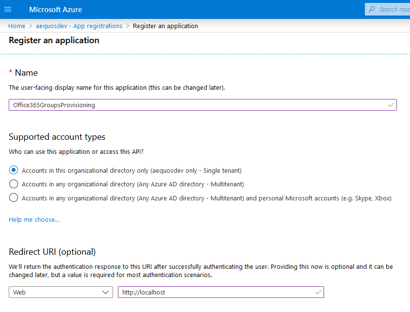
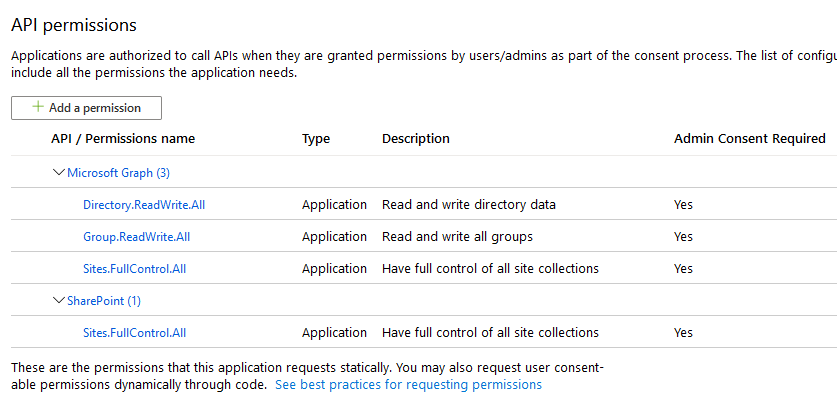
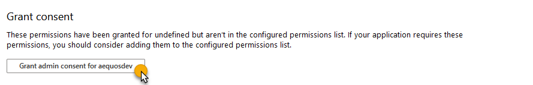
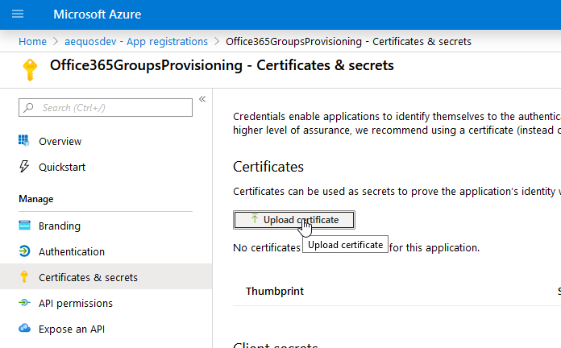
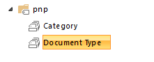
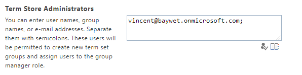
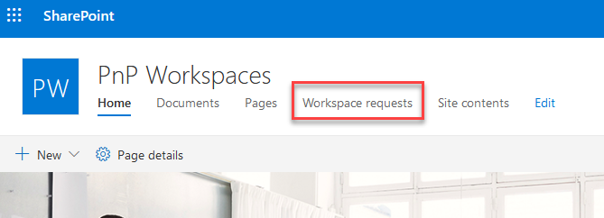

# Part 1 - Setup Azure AD application and workspace requests SharePoint site

The part 1 focuses on the creation on the first building blocks of the solution.

## Setup Azure AD application

To create an new Office 365 group and apply SharePoint PnP templates, we need first to create a new Azure AD application that will use application permissions.

1. In your [Azure tenant](https://aad.portal.azure.com), create a new Azure AD application (in `App Registrations` under `Azure Active Directory`) _Office365GroupsProvisioning_ in the same domain as your Office 365 domain (hosting the SharePoint site new workspace requests will be created). Set correct **application permissions** (not delegated) for _Microsoft Graph_ and _SharePoint Online_ resources as follow:

    

    

    **SharePoint Online**

    | Permission | Used for |
    | ---------- | -------- |
    | Have full control of all site collections (**Sites.FullControl.All**) | SharePoint sites configuration

    **Microsoft Graph**

    | Permission | Used for |
    | ---------- | -------- |
    | Have full control of all site collections (**Sites.FullControl.All**) | Apply PnP Templates for SharePoint sites
    | Read and write directory data (**Directory.ReadWrite.All**) | Manage permissions for Office 365 groups
    | Read and write all groups (**Group.ReadWrite.All**) | Create new Office 365 groups

    Alternatively you can run the following _Azure CLI_ command. (make sure youre located in the `app` folder)
    ```bash
    az ad app create --display-name 'Office365GroupsProvisioning' --available-to-other-tenants false --native-app false --oauth2-allow-implicit-flow true  --required-resource-accesses @app/requiredscopes.json
    ```

1. Grant consent for these permissions:

    

1. Because SharePoint connection requires the use of a certificate, create a new self signed certificate for the Azure AD application using the PowerShell script provided [here](https://docs.microsoft.com/en-us/sharepoint/dev/solution-guidance/security-apponly-azuread).

    ```PowerShell
    .\Create-SelfSignedCertificate.ps1 -CommonName "MyCompanyName" -StartDate 2017-10-01 -EndDate 2021-10-01
    ```

    >  Save the password you use to create the certificate, you will need it after.

1. Upload the certificate (.cer) to you Azure AD application:

    

    Alternatively you can run the following _Azure CLI_ Command.
    ```bash
    az ad app credential reset --id <clientId> --append --cert @<pathToCerFile>
    ```

1. Install [PnP PowerShell SharePoint Online Cmdlets](https://docs.microsoft.com/en-us/powershell/sharepoint/sharepoint-pnp/sharepoint-pnp-cmdlets?view=sharepoint-ps)

    ```PowerShell
    Install-Module SharePointPnPPowerShellOnline
    ```

1. In the SharePoint taxonomy term store, create a new '**pnp**' term group and a '**Category**' and '**Document Type**' term sets with few sample terms:

    

    Note: the Term Store management portal is located at `https://<tenantName>-admin.sharepoint.com/_layouts/15/TermStoreManager.aspx`

    Note: you might need to add your account as a term store administator before you can add any term.

    


## Setup a SharePoint root site for new workspace requests

1. In the current project, from the `templates` folder, open a PowerShell console as administrator and run the following script:
    ```PowerShell
    $tenantName = "" # eq 'aequos' in 'aequos.sharepoint.com'
    Connect-PnPOnline -Url "https://$tenantName-admin.sharepoint.com"
    New-PnPSite -Type CommunicationSite -Title "PnP Workspaces" -Url "https://$tenantName.sharepoint.com/sites/workspaces"
    Connect-PnPOnline -Url "https://$tenantName.sharepoint.com/sites/workspaces"
    Apply-PnPProvisioningTemplate -Path rootsite-template.xml -ResourceFolder ./resources
    ```

    Note: when applying the template, you might get an error message like `The website has been updated by a different process`. This is normal and because we recently created the site, simply re-run the last command

1. Browse your site to see everything is setup correctly. You should see the workspace requests list in the site content navigation.

    


> Next part: [Part 2 - Setup Azure back-end services](./PART2.md)