# Part 2 - Setup Azure back-end services

The part 2 focuses and the Azure back-end services and provisioning assets. This setup can be created in a different Azure tenant than your Office 365 tenant.

## Setup Azure backend services

1. Create a new Azure resource group '_Office365Provisioning_'.

### Storage account

1. Create a new storage account.  
    Note: _Azure CLI_ commands for reference
    ```bash
    az group create --location "Canada East" --name "pnptutorialPractice"
    az storage account create --name pnptutorialpractice --resource-group "pnptutorialPractice" --location "Canada East" --sku Standard_LRS --kind StorageV2
    ```
1. Create a new File Share named '_templates_'.

    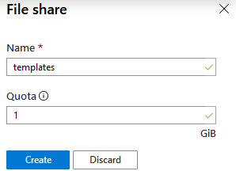  

    Note: _Azure CLI_ commands for reference
    ```bash
    az storage share create --name templates --quota 1 --account-name pnptutorialpractice
    ```

1. Upload the PnP template .xml file `workspace-template.xml`.  
    Note: _Azure CLI_ commands for reference
    ```bash
    az storage file upload --account-name pnptutorialpractice --share-name "templates" --source ./templates/workspace-template.xml --path workspace-template.xml
    ```

1. Create a new directory named `resources` and upload the _.resx_ files from the local resource files.

      
    Note: _Azure CLI_ commands for reference
    ```bash
    az storage directory create --account-name pnptutorialpractice --share-name templates --name resources
    az storage file upload --account-name pnptutorialpractice --share-name "templates" --source ./templates/resources/pnp-workspace-en-us.resx --path resources/pnp-workspace-en-us.resx
    az storage file upload --account-name pnptutorialpractice --share-name "templates" --source ./templates/resources/pnp-workspace-fr-fr.resx --path resources/pnp-workspace-fr-fr.resx
    ```

### Automation account

1. Create a new Azure Automation account.

1. Upload the certificate (.pfx) with the name `pnpCert`. This value is hardcoded in the provisioning script so you need to use the same. **Make sure the certificate is set as 'Exportable'**.

    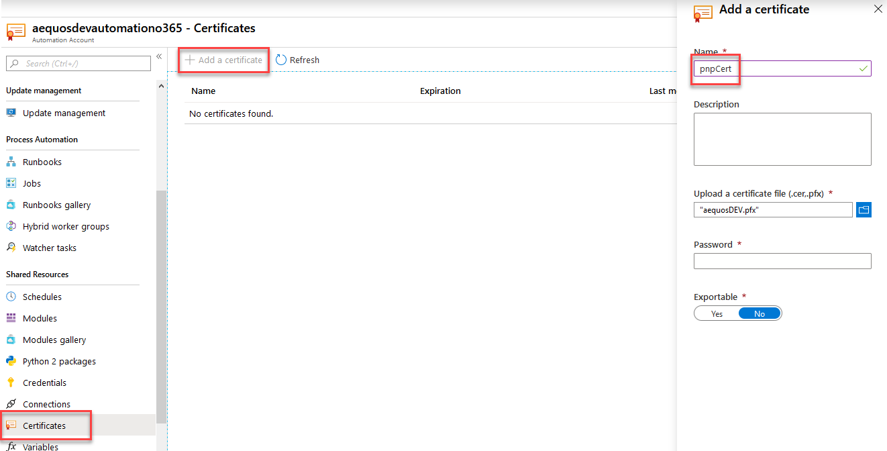

1. Add the '_SharePointPnPPowerShellOnline_' module.

    

1. Create the following automation variables with corresponding values:

    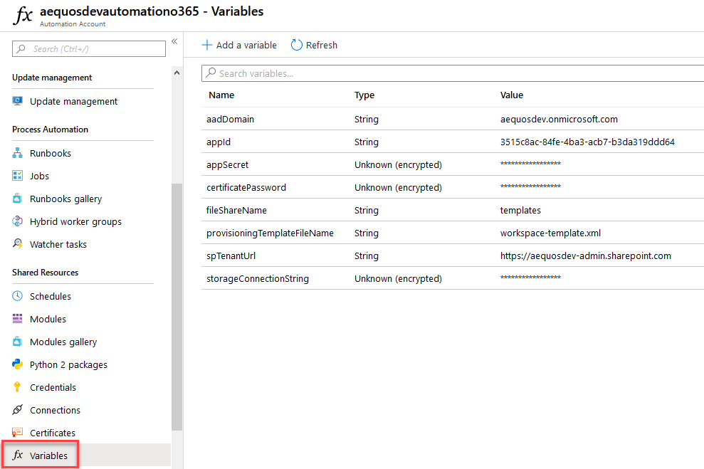

    | Variable | Description | Encrypted | Value |
    | -------- | ----- | ----- | ------ |
    | `certificatePassword` | The certificate password you used as an encrypted value | Yes | ex: '`pass@word1`'
    | `storageConnectionString` | The storage account connection string previously created | Yes | You can get this value by browsing your storage account.<br> 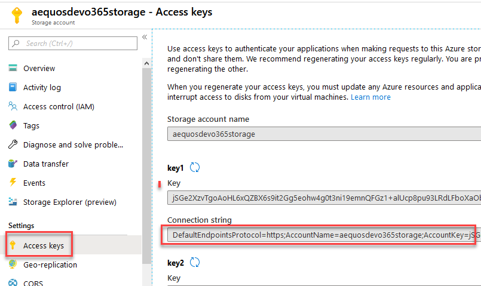
    | `fileShareName` | The name of the file share where template file are stored | No | `templates`
    | `provisioningTemplateFileName` | The name of the template file for workspace creation | No | `workspace-template.xml`
    | `spTenantUrl` | The URL of the SharePoint adminsitartion site | No |Ex: `https://<your_tenant>-admin.sharepoint.com`
    | `appId` | The Azure AD application client ID | No | 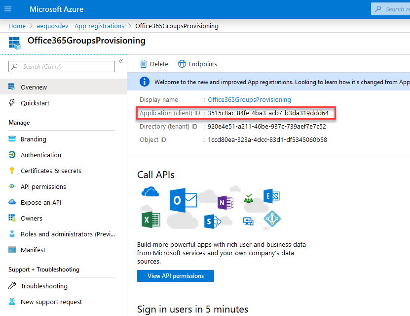
    | `appSecret` | The Azure AD application cient secret | Yes | 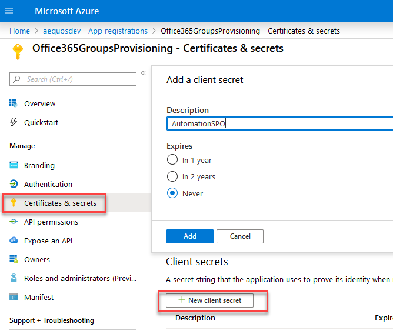
    | `aadDomain` | The Azure AD domain | No | ex: `mydomain.com` or `mycompany.onmicrosoft.com`

1. Create a new runbook called **New-Workspace** and copy/paste the content of the `New-Workspace.ps1` script. Save and **Publish** the file.

    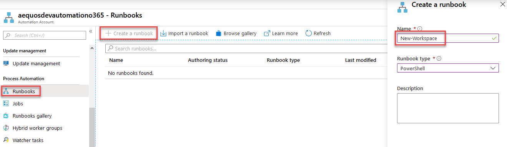

### Logic App for provisioning

1. Create a new Logic App ('_When a HTTP request is received_' template) that will be used for calling the automation runbook. Implement the following steps:

| # | Step | Visual 
| -- | ----- | ------ |
| 1  |Create a HTTP request trigger using the following payload JSON sample to generate th schema.| 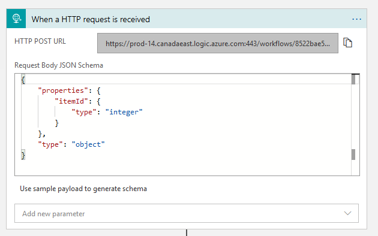 |
| 2  | Get current SharePoint item properties.| 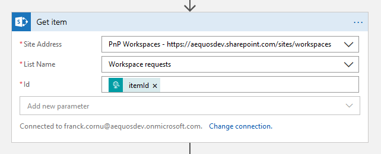 |
| 3  | Set the provisioning status in the requests list. |  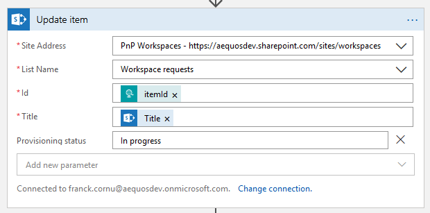 |
| 4  | Create an Azure Automation job using the provisioning runbook. Because the members and categories columns in the requests list are multi values, you will have to use `concat(body('Get_item')?['<columnName>'])` expression in associated parameters. To do so, select first the `concat()` operator and then in parenthesis, select the `Members` or `Category` fields from the output of the step #2 according to the runbook parameter. This will replace the expression with the internal name of the fields. Also make sure you wait for the job to finish. | 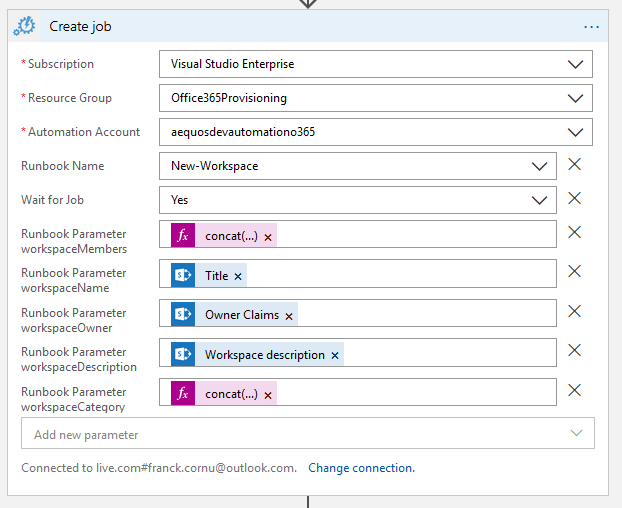 |
| 5 | Get the job status. |  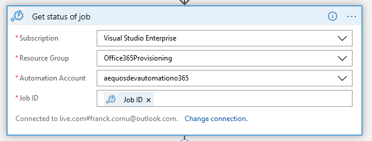 |
| 6 | Set the provisioning status. |   |
| 7 | Create a new condition on the job status value. | 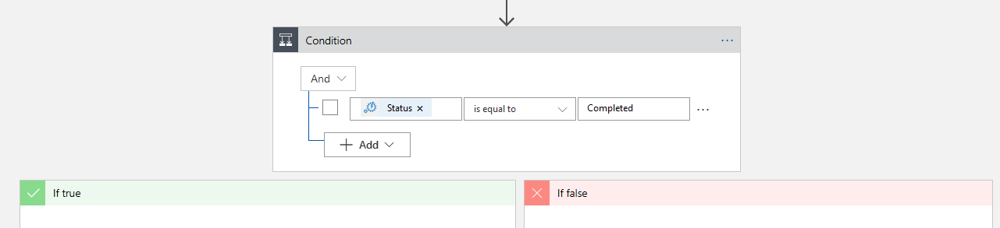 |
| 8 | On the `true` branch, get the job output. | 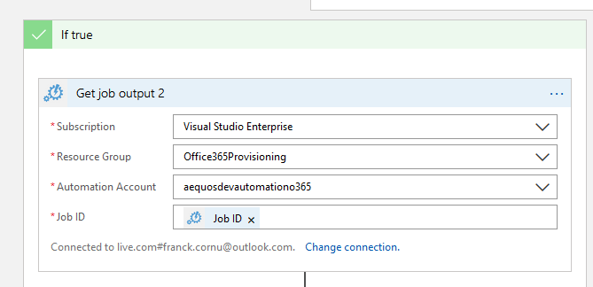
| 9 | On the `true` branch, parse the job output JSON. Use `{ "GroupUrl":""}` as sample payload to generate the schema. | 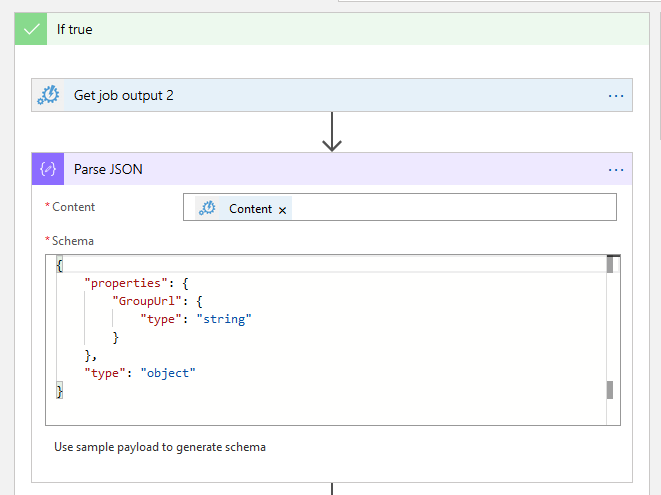
| 10 | On the `true` branch, update the Office 365 group URL in the request list by updating the SharePoint item. | 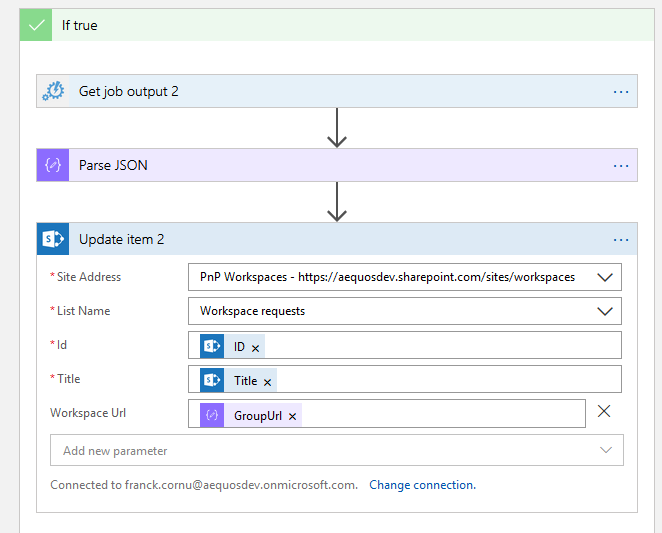
| 11 | In any case, update the job status in the request list. | 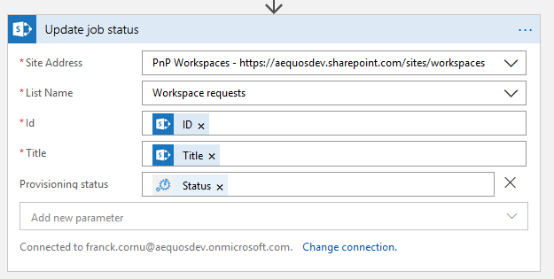

Note: JSON schema for the HTTP trigger
```JSON
{
    "properties":{
        "itemId": {
            "type": "integer"
        }
    },
    "type": "object"
}
```

Note: JSON schema for the parse JSON step
```JSON
{
    "properties": {
        "GroupUrl": {
            "type": "string"
        }
    },
    "type": "object"
}
```

Your final logic app shoud look like this:

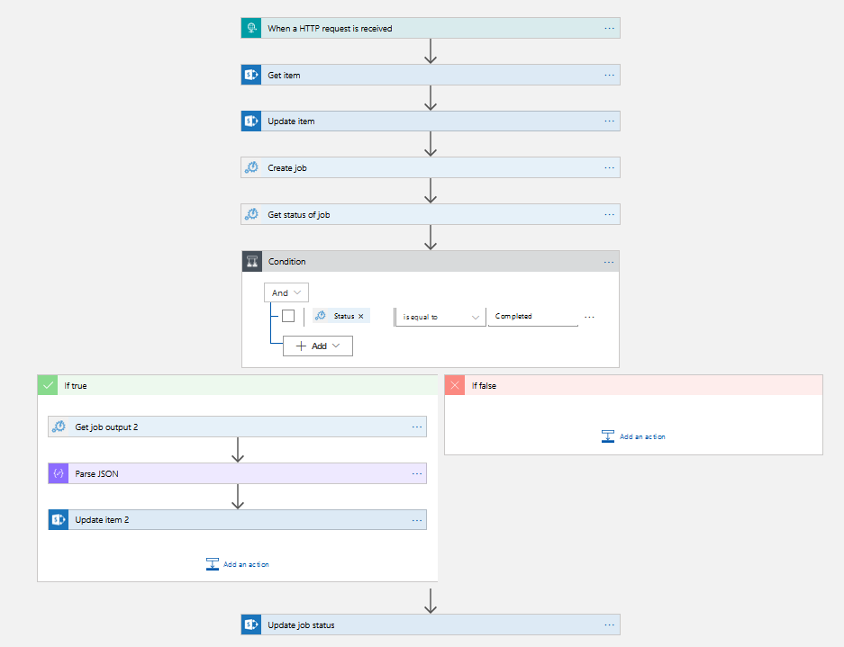

> Next part: [Part 3 - Create and register SharePoint Webhook](./PART3.md)
