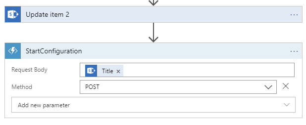

# Part 6 - Setup Teams Configuration

The part 6 demonstrates how you can automate Microsoft Teams Teams configuration and start adding content programmatically so users feel welcome in their new collaboration environments.  

In this part, we will be using Azure Durable Functions with the dotnet framework in combination with the existing solution we built.  

You will notice this function app differs from the previous function app used for the webhook, it is intentionally done to demonstrate multiple technologies at work.  

## Create a new Function app and deploy the code
Because function apps cannot be collocated if they are built with different languages, we need to create a new one.

1. Go to the [Azure Portal](https://portal.azure.com) and create a new function app

    Note: Azure CLI script for reference
    ```bash
    az functionapp create -g pnptutorialpractice --consumption-plan-location canadaeast -n pnptutorialpracticedotnet --storage-account  pnptutorialpractice --runtime node
    ```
1. Build the function app project
    From the `functions/teams-config-function` folder run the following commands
    ```bash
    dotnet restore
    dotnet build --configuration Release --no-restore
    dotnet publish --configuration Release --output publish_output --no-restore --no-build
    ```
1. Package the function app
    ```bash
    rm -f publish.zip
    powershell.exe -nologo -noprofile -command "get-childitem .\publish_output\ | Compress-Archive -DestinationPath ./publish.zip -Update"
    ```
1. Deploy the function app
    ```bash
    az functionapp deployment source config-zip -g pnptutorialpractice -n pnptutorialpracticedotnet --src ./publish.zip
    ```
1. Configuring the function app
    ```bash
    az functionapp config appsettings set -n pnptutorialpracticedotnet -g pnptutorialpractice --settings "TENANT_NAME=baywet" # the tenant in tenant.onmicrosoft.com
    az functionapp config appsettings set -n pnptutorialpracticedotnet -g pnptutorialpractice --settings "LIBRARIES=Shared Documents" #the names of the libraries you want to create tabs for, comma separated
    az functionapp config appsettings set -n pnptutorialpracticedotnet -g pnptutorialpractice --settings "LIBRARIES_SOURCE=https://baywet.sharepoint.com" #the url of the site collection you want the function to create teams tab for
    az functionapp config appsettings set -n pnptutorialpracticedotnet -g pnptutorialpractice --settings "WEBSITE_LOAD_CERTIFICATES=*" #this instructs the function app to load certificates available in the resource group
    az functionapp config appsettings set -n pnptutorialpracticedotnet -g pnptutorialpractice --settings "AUTH_CLIENT_SECRET_CERTIFICATE_THUMBPRINT=11E4A4AD3F71D40602CA7D98FD6F7E4B55E048CB" #certificate thumbprint to use for authentication, you can get this information from the app registration, certificates
    az webapp auth update -g pnptutorialpractice -n pnptutorialpracticedotnet --action AllowAnonymous --aad-token-issuer-url "https://sts.windows.net/bd4c6c31-c49c-4ab6-a0aa-742e07c20232/" --aad-client-id "771365a9-d7c2-4731-98fc-bb8a4e11b873" --query "clientSecretCertificateThumbprint"
    # aad-token-issuer-url: tenant issuer to validate tokens from, make sure you replace the tenant id which you can get from the app registration ovrview page
    # aad-client-id: client id of the application, you can get this from the app registration overview page
    ```
1. Upload the certificate
    ```bash
    az webapp config ssl upload -n pnptutorialpracticedotnet -g pnptutorialpractice --certificate-file <pathToPfx> --certificate-password <pfxPassword>
    ```
## Update the logic app
1. Edit the logic app previously created.
1. In the _If True_ part of the condition, add a new action (after the update item action)
1. Search for _Azure Functions_, select the function app we created and then the `StartConfiguration` function.
1. In the _Body_ pass the _Title_ from the _Get Item_ action.
1. Add a new parameter, select _Method_ and select _POST_ as the value.
1. Save the Logic App

    Note: Screenshot for reference.  
    

## Update app permissions
Note: you can skip this step if you used the CLI to register the application
1. Go the app registration using the [Azure Portal](https://aad.portal.azure.com)
1. Navigate to the application we previously registered
1. Navigate to _API Permissions_
1. Add the _Microsoft Graph_ _Application Permission_ _Sites.Read.All_
1. Save
1. Click on `Grant Admin Constent`

## Test
1. Start a new workspace creation from the requests list
1. Wait a few minutes for the execution to complete
1. Log on [Microsoft Teams](https://teams.microsoft.com), notice the new team, with an additional channel and a tab configured for this channel.
